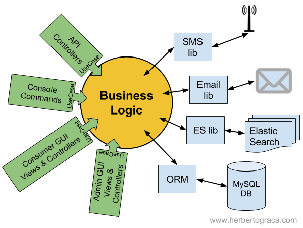
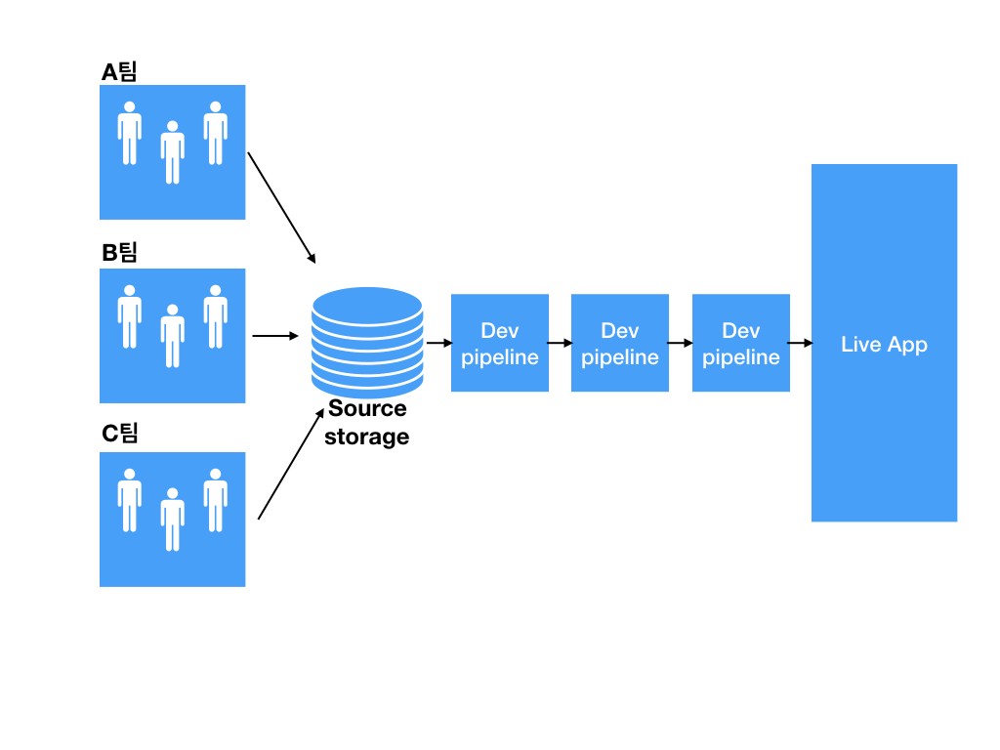

[MSA] - 1장 모놀리식 지옥에서 벗어나자.
---

1. 모놀리식 아키텍쳐
 - 의미 : MSA가 아닌 전통 아키텍쳐를 가리키는 지칭
 - 구조 : 책에서는 FTGO를 예를 들었는데 아래 사진이 가장 비슷할 것 같다.
비즈니스로직과 외부 시스템은 어댑터(adapter)를 통해 연결되어 있다.
 
  
 - 장단점
 
 |  |내용|
 |---|---|
 |장점|1. 개발이 간단하다.|
 |  |2. 애플리케이션을 변경하기 쉽다.|
 |  |3. 테스트하기 슆다.|
 |  |4. 배포하기 쉽다.|
 |  |3. 확장하기 쉽다.|
 |단점|**어플리케이션의 규모가 커지면 장점이 단점이 되어 버린다!.**|
 
 - 왜? 단일 소스코드 스토리지를 가진 규모가 큰 팀이 함께 개발을 한다면... 위의 장점은 단점이 된다.
  

2. MSA 패턴

 - 확장 큐브 :
 
 
 
   - x축 : 다중 인스턴스에 요청 분산
   - y축 : 요청 속성별 라우팅
   - z축 : 기능에 의한 서비스 분리
   
   - 장단점
   
   |  |내용|
    |---|---|
    |장점|1. 크고 복잡한 애플리케이션을 지속적으로 전달/배포 가능|
    |  |2. 서비스 규모가 작아 관리하기 쉽다.|
    |  |3. 서비스를 독립적으로 배포/확장할 수 있다.|
    |  |4. 결함격리가 잘된다.|
    |  |3. 신기술 도입이 쉽다.|
    |단점|1.적절한 서비스를 찾기 쉽지 않다.|
    |  |2. 복잡도가 상승한다.|
        |  |3. 공통 기능 배포에 신경써야 한다.|
        |  |4. 도입시기를 결정하기 어렵다.|